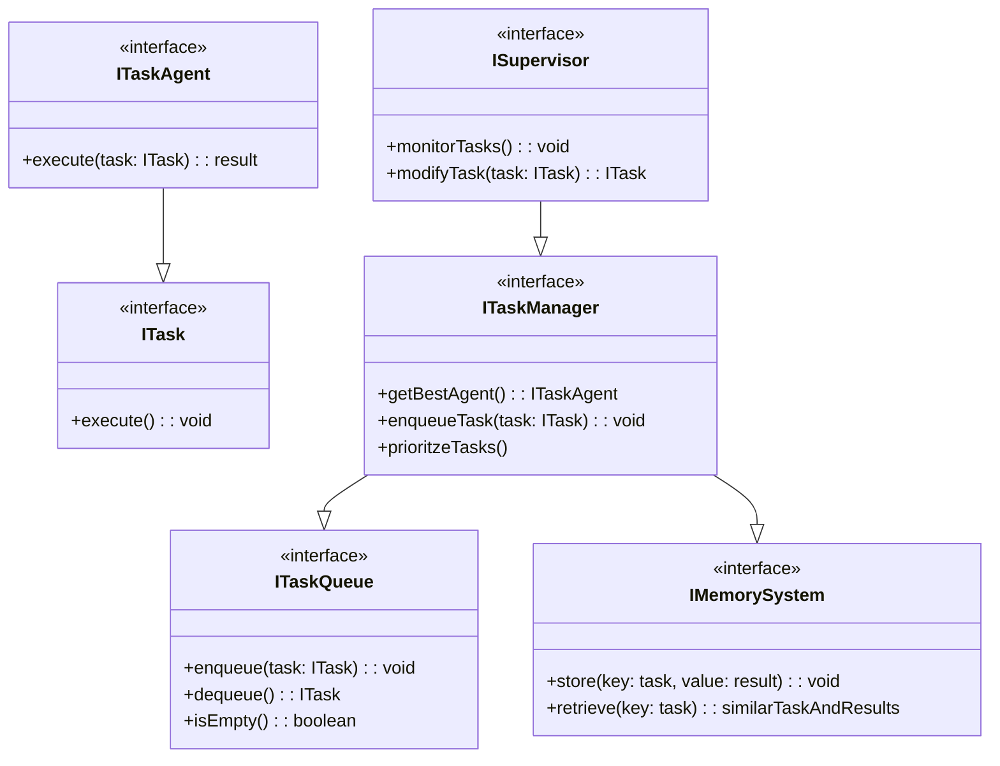
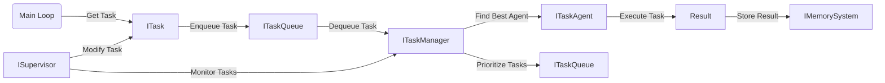

ModularIntellect is an open source project that will create an autonomous agent that can break down and execute tasks with various agents such as different large language models and APIs to get and process information. It is intelligent and autonomous and the project uses a modular dependency injection architecture in order to allow for flexible implementations of each of the different components. The components include a task queue system, a memory system to keep track of past results, a task manager that understands which agent would be best for a task, and task agents which execute the tasks themselves. There is also an overall supervisor which can modify tasks and ensures that everything is complying with an overarching imperative. The project name should be concise, interesting and descriptive.
Below is a mermaid diagram showing the interface classes within the modular architechture. 

Modular Interfaces

Flow Chart
