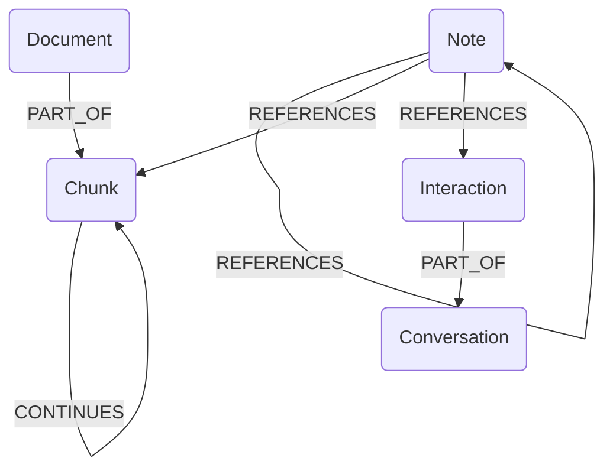
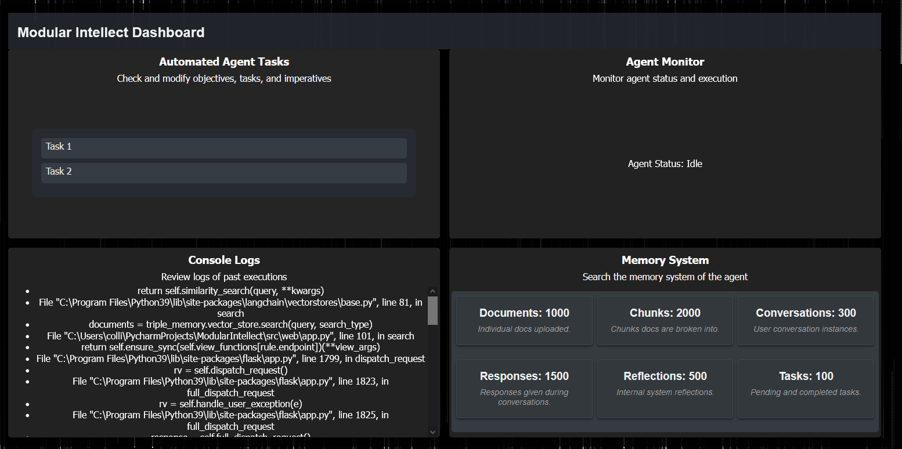

# Overview
ModularIntellect is an experimental general purpose autonomous work assistant with a web interface to visualize, interact with, and debug its thought process. 
ModularIntellect uses langchain as a toolkit for common large language model tasks which are used as the basis of cognition for the agent. It uses OpenAI's ChatGPT as the language model, Neo4j as the graph database, and FAISS as the vector index. The web interface uses React and Typescript.

# Autonomous Assistant Agent
This repository attempts to create a general purpose autonomous assistant using large language models as the cognitive engine. Large language models such as ChatGPT have had surprising emergent intelligence for a wide range of tasks. Natural language has been a proven medium to store and transmit ideas and knowledge. Large language models are the first artificial computational system that can create and process natural language at a level sufficient to be generally useful. LLMs themselves are not fully capable of all parts of general intelligence. One key limitation arises with problems that require a large amount of context. There is a limited token window within which to fit all of the information being fed to the model. This repository explores one possible approach to solving this problem: a hybrid semantic and graph based memory system that the language model is given access to explore through prompting. By giving the LLM full access to explore the memory system, I hope to achieve an agent capable of solving complex problems that require a large amount of context as well as abstract reasoning through iteratively building upon previous thoughts to make more abstract connections and inferences.


### Core Underlying Components of Artificial Cognition Agent:
Memory - Cohesion over time, learning through experience, specific knowledgebase for particular application
Cognition Engine - Solve Problems, Reason, Generate text (LLM)
Interaction with world - Simply communicating with people via natural language (which is a much more natural way for people to communicate with computers compared with programming languages because everyone already knows how to speak and write in natural language)

### Key Functionality:
Planning and decomposing tasks into steps
Value Alignment
Auditability/Human Intervention
Use of Tools (Functional Augmentations - task specific functionality for quicker, more reliable performance)

# Memory System
 The memory system is designed to be accessible to the language model in two ways: semantic search to find relevant information and the graph structure to traverse though relationships between information. Through prompting, the language model is presented with both an initial lookup of relevant information to a query and also an overview of connections tho those  pieces of information has within the graph that the language model can request to look up. Through this process, the language model continues to build up the information it needs to answer the question as it requests promising nodes within the database. This allows for the system to quickly get to the information it needs to answer complicated questions that require drawing from multiple sources of information. Additionally, the system can reflect internally on its observations and thoughts to create notes which refer to other chunks or even other notes to allow for abstract, complex thoughts. This will hopefully result in an agent that mirrors human level intelligence.

The memory system is built upon Neo4j as the graph database and FAISS as the vector index. The memory system holds uploaded documents, records of user interactions, and the agent's own internal thought processes. These interactions are stored as different node types including Document, Chunk, Interaction, Note, and Conversation.

- `Document` nodes represent documents that users feed into the system. These documents are broken down into smaller `Chunk` nodes to fit into the context window of large language models.
- `Interaction` nodes record the interactions between the user and the agent.
- `Note` nodes represent the agent's internal reflections on its observations and thoughts, these could refer to other chunks or even other notes.
- `Conversation` represent a session of back and forth messaging with a user. Each message is stored as an `Interaction` node.


The inclusion of Note nodes within the schema allows the agent to develop abstract and complex thoughts, mirroring human-like cognition. The agent can create notes that refer to other chunks of information, which can in turn link to other notes, forming a web of interconnected thoughts and observations.

(Reference human simulacrum paper) (reference vectorDB paper)

Graph Database Memory Schema


# Web Interface
It provides a web interface for inspecting and interacting with the various components of the system in order to facilitate the synthesis of understanding of the system.
Specifically, web interface allows users to view and modify the internal thought process 
of the autonomous agent including queries made to the large language model and memory system. It also records logs of all events that can be reviewed later. Fainlly, it provides an interface to search the memory system to inspect its contents and to upload new documents to the memory system.



# Setup:
1. Install requirements.txt
2. Build frontend with webpack: `npm run build`
3. Create Neo4j account - this project uses their free aura instance
4. Copy OpenAI API key and Neo4j login information into .env file
5. Run app.py, which will open the web interface on localhost:5000

.env file format:
```
OPEN_API_KEY=<your key>
NEO4J_URI=<your uri>
NEO4J_USER=<your user>
NEO4J_PASSWORD=<your pass>
```

# AI Content Disclosure
Some of the code within this repository was generated using the assistance of artificial intelligence (AI) technologies. These AI-generated portions are a collaborative effort, with human review, editing, and validation.

