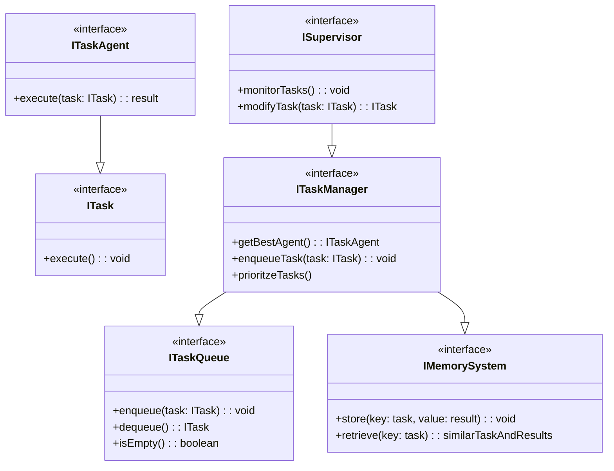
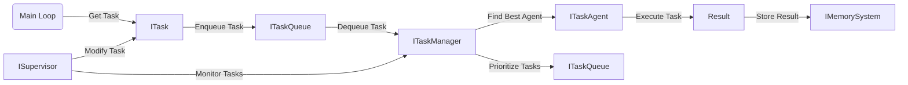

ModularIntellect is an open source experiment with the goal of creating a modular cognitive architecture to realize true general intelligence.
ModularIntellect uses langchain as a toolkit for common large language model tasks which are used as the basis of cognition for the agent. It adds a web interface for inspecting and interacting with the various components of the system in order to facilitate the synthesis of understanding of the system.
Below is a mermaid diagram showing the interface classes within the modular architechture. 

Core Underlying Components of Artificial Cognition Agent:
Memory - Cohesion over time, learning through experience, needs efficient similarity search (VectorDB)
Cognition Engine - Solve Problems, Reason, including Complex and abstract (LLM)

Key Functionality:
Planning (GOMS)
Value Alignment
Auditability/Human Intervention

Augmentations - (task specific extension functionality for augmented performance):
Tools such as calculators and access to reference information such as textbooks, wikipedia, etc.

Modular Interfaces

Flow Chart
